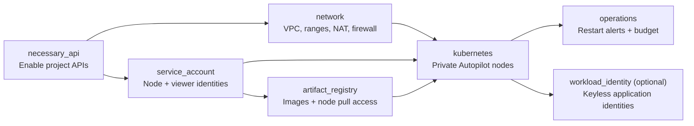

# Google Cloud Infrastructure with Terraform

A **single-region GKE Autopilot foundation for small production services**, with private nodes, shared Terraform state, keyless identities, an image registry, and operational alerts.

**Use it for:** hosting containerized APIs and web services while Google manages Kubernetes nodes. Application deployment and recovery testing are handled separately.

## At a glance

| Specification | Configuration |
| --- | --- |
| Kubernetes | 1 regional Autopilot cluster; Regular release channel |
| Location | `us-central1` (configurable); one project per environment |
| Network | Private nodes; VPC + Pod/Service ranges; Cloud NAT |
| Cluster access | IAM-authenticated DNS endpoint; private IP endpoint |
| Identity | Dedicated node account; optional per-workload identities |
| Images | Regional Docker registry; immutable tags |
| Operations | Logs, metrics, restart alerts, monthly budget notifications |
| State | Private, versioned GCS bucket with state locking |
| Tooling | Terraform `>= 1.9, < 2.0`; Google provider `~> 6.12.0` |

## Module architecture

Arrows show dependencies. `bootstrap` provisions state storage separately before the root modules run.

Browse [modules](modules/) and [state bootstrap](bootstrap/). The standalone [virtual_machine](modules/virtual_machine/) module is optional, has a public IP, and is **not deployed by the root**.

## GitHub Actions

On every push, pull request, or manual trigger, the [workflow](.github/workflows/terraform.yml) checks formatting, validates the root, VM and bootstrap configurations, and runs mocked tests for production safeguards using Terraform **1.9.8**. CI needs no cloud credentials; deployment is manual.

## Deploy

Follow the **[deployment guide](docs/deployment.md)** to create the state bucket, configure your project, billing budget and alert recipient, then review and apply a plan.

**Readiness:** configuration and mocked tests do not prove a live service is ready. Complete the [production verification steps](docs/production.md) for access, alerts, workload availability and recovery before serving users. Budget alerts are notifications, not spending caps; GKE, NAT, storage and telemetry incur charges.
