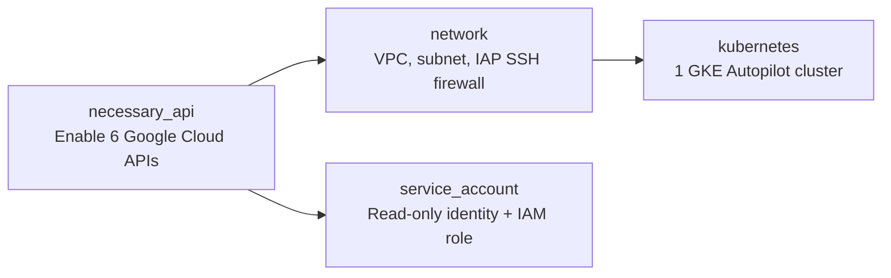

# Google Cloud Infrastructure with Terraform

Deploy a **GKE Autopilot environment** with networking and a read-only service account in an existing Google Cloud project.

**Use it for:** learning Google Cloud infrastructure, Kubernetes demos, and development environments. Applications are deployed separately; production use needs additional configuration.

## At a glance

| Specification | Default deployment |
| --- | --- |
| Kubernetes | 1 regional GKE Autopilot cluster |
| Location | `us-central1` (configurable) |
| Network | Custom VPC + subnet `10.0.0.0/24` |
| Identity | Service account with Container Viewer; no keys generated |
| Protection | Cluster deletion protection enabled |
| Tooling | Terraform `>= 1.9, < 2.0`; Google provider `~> 6.12.0` |

## Module architecture

Arrows show module dependencies: APIs are enabled first, then networking and identity; GKE uses the network outputs.



Module source: [necessary_api](modules/necessary_api/) · [network](modules/network/) · [service_account](modules/service_account/) · [kubernetes](modules/kubernetes/).

**Optional:** [virtual_machine](modules/virtual_machine/) creates an Ubuntu 22.04 VM (`e2-medium`, 20 GB disk, public IP, OS Login). It is **not called by the root configuration**.

## GitHub Actions

The [Terraform validation workflow](.github/workflows/terraform.yml) runs on every push, pull request, or manual trigger using Terraform **1.9.8**:

- Checks formatting across all modules (`terraform fmt`).
- Initializes providers without a state backend and validates the root configuration and optional VM module (`terraform validate`).

These checks catch formatting and configuration errors without cloud credentials. Deployment remains manual; CI does not run `plan` or `apply`.

## Deploy

Requires a billed Google Cloud project, Google Cloud CLI authentication, and deployment permissions.

```bash
cp terraform.tfvars.example terraform.tfvars
# Set your project_id and preferred region/zone.
terraform init
terraform plan -out=deployment.tfplan
terraform apply deployment.tfplan
```

Deployment creates billable resources. State is local by default. No applications or Artifact Registry repository are created.

See the **[deployment guide](docs/deployment.md)** for authentication, permissions, inputs/outputs, cluster access, production limitations, migration notes, and cleanup.
